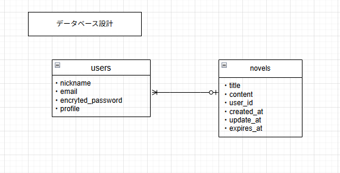
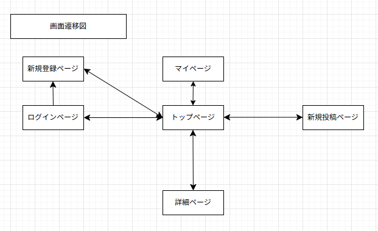

# README
# アプリケーション名
泡沫文庫
Bubble Library

# アプリケーション概要
・1000文字以内の短編小説を投稿・閲覧できる

# URL
https://bubble-libraly.onrender.com

# テスト用アカウント
BASIC認証 
ID:admin 
password:2222

# 利用方法
1.トップページのヘッダーからユーザー新規登録を行う 
2.新規投稿ボタンから、小説を投稿する 
3.投稿した小説が指定した時間(デフォルトでは24時間後)に削除される

# アプリケーションを作成した背景
・「一期一会」の読書体験:
  SNSのストーリー機能のように、"今しか読めない"という限定感が、読者に「見逃したくない」という気持ちを抱かせます。一つ一つの作品との出会いが、より特別なものになる。

・作者の投稿ハードルを下げる:
  「いずれ消える」という安心感と、「短い文字数でOK」という手軽さから、完璧な作品でなくても気軽に投稿しやすくなります。アイデアの断片や、ふと思いついた物語の習作などを発表する場として最適。

・読者の閲覧ハードルを下げる:
  短編なので、通勤・通学中や寝る前などのちょっとした隙間時間でサクッと読み切れる。

# 実装した機能についての画像やGIFおよびその説明
・投稿した内容が指定時間になったら削除される動画

# 実装予定の機能
・いいね機能
・ユーザーフォロー機能

# データベース設計

# 画面遷移図

# 開発環境
 ・フロントエンド 
 ・バックエンド 
 ・テスト環境 
 ・インフラ 
 ・テキストエディタ 
 ・タスク管理 

# ローカルでの動作方法
以下のコマンドを実行 
% git clone  
% cd bubble library 
% bundle install 
% rails db:create 
% rails db:migrate 
% rails s 

# 工夫したポイント
・投稿した小説が消えるということ 
・1000文字以内の短編専用の小説アプリのため、サクッと楽しめる 
・PC、スマートフォンの両方から利用できる 

# 改善点
 ・UI改善 
   文字色、背景色の改善

 ・実装予定機能 
   マイページ機能
   いいね機能
   ユーザーフォロー機能

# 制作時間
 約10日

